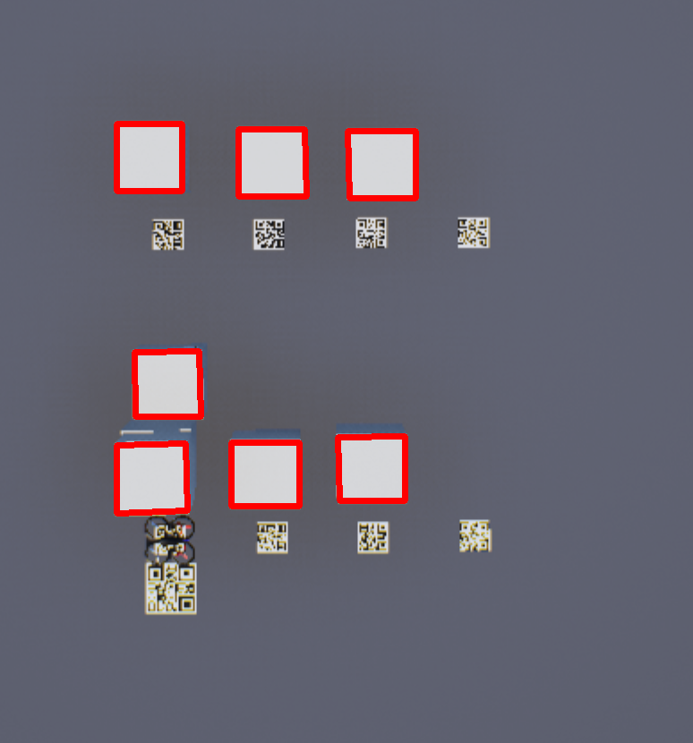
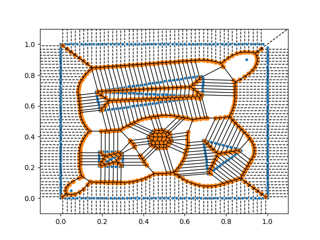
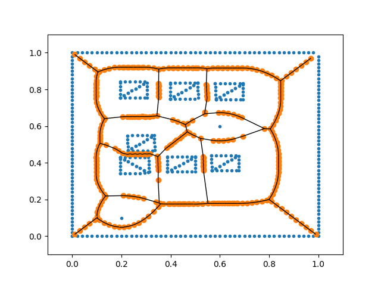
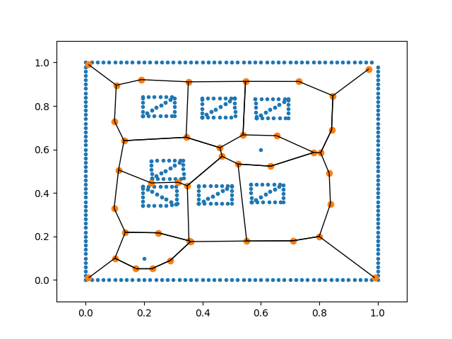
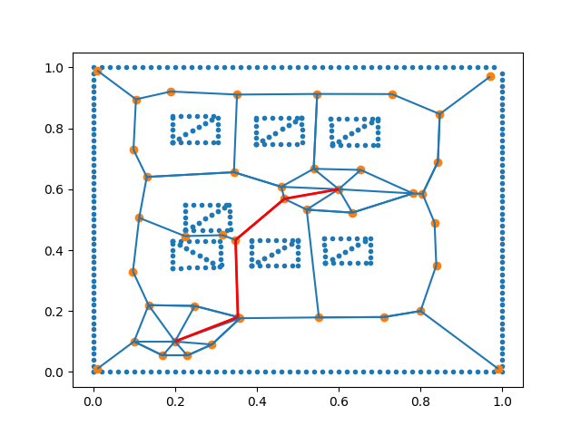

# Polygon based voronoi diagram

### Requirments
~~~
python   
    - numpy  
    - matplotlib  
    - scipy  
    - rdp  
    - opencv-python  
~~~
-----

### Result
* polygon detected result  
  

* non polygon lined(normal point based voronoi diagram)  
  

* non vertex deleted  
  

* result of polygon based voronoi diagram  
  

* result after optimization  
  

* astar algorithm using optimized result  
  
