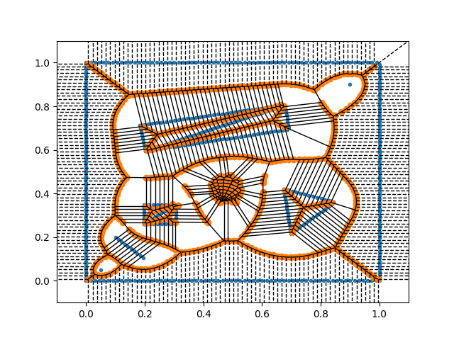
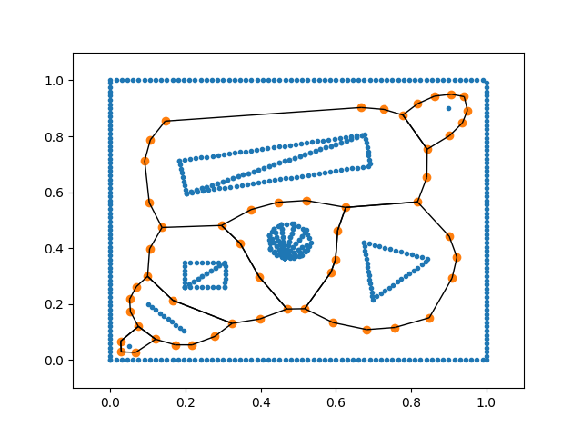
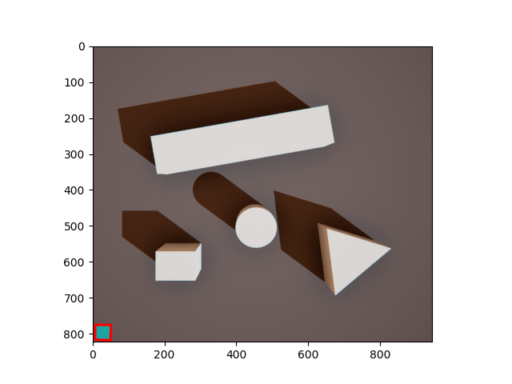
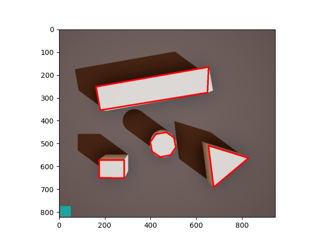

# Generalized voronoi diagram  
A generalized voronoi diagram for python.  
Supports points, lines, polygons on generation.  
Description is available at https://doi.org/10.5391/IJFIS.2023.23.3.259  

-----  

### Requirments
~~~
python   
    - numpy  
    - matplotlib  
    - scipy  
    - rdp  
    - opencv-python  
    - numba  
    - tripy  
    - pyvisgraph  
~~~
-----  
  
### Path planning demo result
* non polygon lined(normal point based voronoi diagram)  
  

* non vertex deleted  
  

* result of polygon based voronoi diagram  
  

* result after optimization  
  

* astar algorithm using optimized result  
  
-----  
  
### AirSim demo result
* reference detected result  
  

* polygon detected result  
  
  

https://user-images.githubusercontent.com/44907014/210353329-dc3fa047-4703-4018-9efe-72b539aa2ece.mp4

